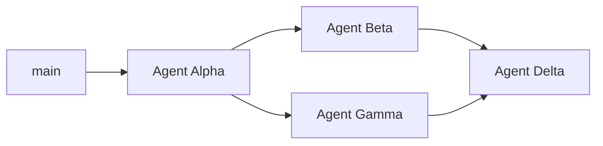

# Four-agent attack plan — Household Budget PWA

**Goal:** Move this app toward state-of-the-art household finance UX: one entry propagates everywhere it should, receipt photos are obvious and auto-fill spending, and four agents can work in parallel without stomping the same files.

**Machine-readable ownership:** [`AGENT-OWNERSHIP.json`](./AGENT-OWNERSHIP.json)

---

## Executive audit (current state)

### What you already have (strong foundation)

| Area | Status | Key paths |
|------|--------|-----------|
| Receipt upload + OCR | **Shipped** | `/receipts`, `src/lib/receiptOcr.ts`, `src/app/actions/receipts.ts` |
| OCR → expenses | **Shipped** | `ReceiptPostExpenseForm`, `ReceiptBatchExpensesForm` |
| Pay stub OCR | **Best-effort** | `QuickForms` paycheck + `src/lib/paystubOcr.ts` |
| Bank import | CSV/OFX/QIF + Plaid sync | `/import`, `/plaid` |
| Tax workpaper | IRC guidance + bulk assign | `/tax` |
| PWA offline shell | Serwist | `src/sw.ts`, `/~offline` |

### Why receipt capture feels “missing”

The feature **exists** but is **hard to discover on mobile**:

1. **Mobile bottom nav** (`MobileBottomNav.tsx`) lists Home, Expenses, Bills, Budgets, Coach — **no Receipts**.
2. Desktop header includes Receipts, but mobile users rarely open the full nav.
3. Overview has a “Receipt upload” link, but it competes with a large Quick add form that does **not** accept photos.
4. After OCR, posting uses `spentAt: new Date()` — not receipt date — so amounts don’t “feel” tied to the right day in `/expenses` or `/flow`.
5. Batch post from parsed lines has **no budget envelope** — user must edit each row on `/expenses`.
6. Production without `BLOB_READ_WRITE_TOKEN` loses files on ephemeral disk (`src/lib/env.ts` warns).

**Agent Beta** owns fixing discoverability and the receipt → expense pipeline. **Agent Alpha** owns date/merchant/budget propagation rules. **Agent Gamma** owns making Quick add fields match full editors.

### Why “one field doesn’t populate everywhere”

There is **no client global store** (no Context, Zustand, React Query). State is:

- Postgres via Prisma (source of truth)
- Server Actions + `revalidatePath` (full page refresh)

Pain points are **product/model** gaps, not a missing React library:

| Entry surface | Fields captured | Missing downstream |
|---------------|-----------------|-------------------|
| Quick add expense | description, amount | `spentAt`, `payee`, `tags`, `budgetPlanId` |
| Receipt → single expense | amount, description, budget | `spentAt` from OCR date |
| Receipt → batch lines | yearMonth only | per-line budget, tags, dates |
| Merchant rules | pattern → tag | no auto `budgetPlanId` |
| Plaid sync | Plaid fields | no auto budget/tags |
| Bills / budgets | duplicated across 3 forms each | same fields, no shared component |

There is also **no unified `Transaction` model** — money is split across `Expense`, `Paycheck`, `Bill`, `BudgetPlan`, `DebtAccount`, `NetWorthAccount`, `PlaidItem`.

---

## State-of-the-art gap analysis (what’s missing)

Benchmark against leading apps (YNAB, Monarch, Copilot, Rocket Money, Mint-class) and modern PWAs.

### P0 — Core UX (this sprint’s four agents)

| Gap | Owner agent |
|-----|-------------|
| Field parity: quick add = full editor for expenses | Gamma |
| Propagation: merchant/tags → budget suggestion; OCR date → `spentAt` | Alpha |
| Receipt on home + mobile nav + inline capture on `/expenses` | Beta |
| Auto-post flow: OCR complete → pre-filled review → one tap post | Beta |
| Remove duplicate bill/budget forms via shared components | Gamma |

### P1 — Trust & data (Delta + follow-up)

| Gap | Notes |
|-----|-------|
| Plaid token encryption at rest | Schema comment today; Delta |
| Scheduled Plaid sync / webhook | Manual “Sync” only |
| Web push bill reminders | ROADMAP unchecked |
| Real-time OCR status (SSE or polling UX polish) | Beta extends poller |

### P2 — SOTA financial features (post-sprint)

| Gap | Notes |
|-----|-------|
| Unified activity feed (all money in/out one timeline) | New view or extend `/flow` |
| Recurring/subscription detection → bill drafts | `/insights` has hints only |
| Split transactions UI on receipt lines before post | Beta/Gamma |
| Net worth / debt Plaid balance sync | Not started |
| Shopping trip → expense posting | Trips isolated |
| Multi-currency, joint vs personal splits | Household-only today |
| AI categorization (LLM) vs regex OCR | Optional upgrade path |

### P3 — Compliance & enterprise polish (Delta doc)

| Gap | Notes |
|-----|-------|
| SOC2-style audit log for money mutations | Tax audit exists for tax rows only |
| Export to QBO / OFX out | CSV export in only |
| 2FA, session device list | iron-session only |

---

## Parallel work rules (no agents on top of each other)

### Branch naming

```
cursor/agent-alpha-propagation-3044
cursor/agent-beta-receipts-3044
cursor/agent-gamma-forms-3044
cursor/agent-delta-audit-3044
```

Always branch from latest `main` after the prior agent in **merge order** has merged (or rebase onto it).

### Merge order



1. **Alpha first** — introduces `src/lib/entry/*` contracts (no UI). Others import these helpers.
2. **Beta and Gamma in parallel** — after Alpha is on `main`; they must not edit each other’s forbidden paths.
3. **Delta last** — documents outcomes + security/Plaid/PWA; rebases on all three.

### Hard rules

- Before editing, read `docs/AGENT-OWNERSHIP.json`. If a path is **forbidden**, do not touch it — open a PR comment for the owning agent instead.
- **One PR per agent per branch.** No drive-by refactors outside `owns`.
- **`monthly.ts`:** Alpha adds exported functions; Gamma calls them from `unifiedQuickEntryAction`. Beta does **not** edit `monthly.ts`.
- **`page.tsx`:** Beta may add receipt CTA blocks; Gamma does **not** edit overview hero/quick-add shell.
- **`MobileBottomNav.tsx`:** Beta only (receipt discoverability).
- **Schema changes:** Alpha only. Beta/Gamma request migrations via issue if needed.

### Shared contract (Alpha publishes first)

Create `src/lib/entry/types.ts` and `src/lib/entry/propagate.ts`:

```ts
// types.ts — canonical shape for “money out” creation
export type ExpenseDraft = {
  description: string;
  amountCents: number;
  spentAt: Date;
  payee?: string | null;
  tags?: string[];
  budgetPlanId?: string | null;
  receiptId?: string | null;
  source: "manual" | "ocr" | "plaid" | "import";
};

// propagate.ts
export function applyMerchantRules(draft: ExpenseDraft, rules: MerchantRule[]): ExpenseDraft;
export function suggestBudgetPlanId(draft: ExpenseDraft, plans: BudgetPlan[]): string | null;
export function spentAtFromOcr(rawText: string, parsedLines: ParsedReceiptLine[], fallback: Date): Date;
```

Beta and Gamma **import** these; they do not duplicate inference logic.

---

## Agent Alpha — Data propagation & domain contracts

**Branch:** `cursor/agent-alpha-propagation-3044`

### Mission

Make one logical “expense draft” propagate consistent fields everywhere it is persisted.

### Deliverables

1. `src/lib/entry/types.ts`, `propagate.ts`, `spentAt.ts`
2. Wire `createExpenseFromReceiptAction` and `createExpensesFromReceiptLinesAction` to use `spentAtFromOcr` and `applyMerchantRules`
3. Wire `unifiedQuickEntryAction` (expense path) to accept optional `spentAt`, `tags`, `budgetPlanId` in FormData — **Gamma adds UI fields later**
4. Optional migration: `Expense.ocrSpentAt` only if needed — prefer computing at post time from receipt OCR JSON
5. Unit-style tests in `src/lib/entry/*.test.ts` if adding test runner; otherwise document examples in `src/lib/entry/README.md`

### Acceptance criteria

- Posting from receipt sets `spentAt` to OCR-inferred date when confidence ≥ threshold; else upload date
- Merchant rules append tags on all create paths (quick, receipt, import, plaid)
- `suggestBudgetPlanId` returns a match when `BudgetPlan.category` substring matches description/payee

### Do not

- Change any React components
- Change receipt OCR parsing regex (Beta)

---

## Agent Beta — Receipt capture, OCR & discoverability

**Branch:** `cursor/agent-beta-receipts-3044`

### Mission

Users should **see** receipt capture immediately and trust OCR → easy entry.

### Deliverables

1. **Mobile nav:** Add “Receipts” (replace “Coach” on bar or add 6th item “More” sheet — document choice in PR)
2. **Home:** Prominent “Scan receipt” button opening `/receipts?ym=` or native file picker modal
3. **`/expenses`:** Sticky “Add from receipt” linking to receipts filtered to current `?ym=`
4. **Inline upload component** `ReceiptQuickCapture.tsx` on overview (optional embed; uses existing `uploadReceiptAction`)
5. **Post-OCR UX:** Review card showing parsed total + lines + suggested budget (call Alpha’s `suggestBudgetPlanId` after merge)
6. **Poller:** Extend `OcrStatusPoller` max duration or show “still processing” with reprocess CTA
7. **Blob guard:** Surface env warning banner in receipts page when `BLOB_READ_WRITE_TOKEN` missing

### Acceptance criteria

- New user on phone finds receipt upload in ≤2 taps from Home
- After OCR completes, user sees amount + description pre-filled without retyping filename
- Batch post can set one shared `budgetPlanId` for all lines (form field only; server action already in Alpha/Gamma coordination)

### Do not

- Refactor `QuickForms.tsx` (Gamma)
- Change Prisma schema (Alpha)

---

## Agent Gamma — Unified entry forms & field parity

**Branch:** `cursor/agent-gamma-forms-3044`

### Mission

Enter once with full fields; stop maintaining four parallel copies of the same inputs.

### Deliverables

1. `src/components/entry/ExpenseFields.tsx` — description, amount, spentAt, payee, tags, budgetPlanId
2. `src/components/entry/BillFields.tsx`, `BudgetLineFields.tsx`
3. Refactor `QuickForms`, `BillAddForm`, `BudgetAddForm`, `BillRow`, `BudgetPlanRow` to compose shared fields
4. Quick add expense includes **date** + **budget** + **tags** (optional payee)
5. `ExpensesInteractiveList` inline edit uses same `ExpenseFields` for consistent labels/validation
6. Deprecate duplicate grid markup; keep Server Actions unchanged except new FormData keys Alpha supports

### Acceptance criteria

- Same field names and labels on Home quick add and `/expenses` row editor
- Submitting quick add with budget + tags shows correct values on `/expenses` without second edit
- No visual regression on desktop bill/budget pages

### Do not

- Touch `src/app/(app)/receipts/**` (Beta)
- Touch OCR libs (Beta)

---

## Agent Delta — SOTA audit, security & platform

**Branch:** `cursor/agent-delta-audit-3044`

### Mission

Research-backed audit artifact + targeted hardening without UI overlap.

### Deliverables

1. **`docs/AUDIT-SOTA.md`** — scored rubric (1–5) per category: capture, categorization, sync, reporting, tax, security, mobile/PWA, accessibility
2. **`docs/COMPLIANCE-CHECKLIST.md`** — IRS substantiation mapping to existing tax module
3. **ROADMAP.md** — P0/P1/P2 from this plan
4. **Security:** Document Plaid token encryption approach; implement envelope encryption helper OR `// @encrypt` migration plan in audit if scope too large
5. **PWA:** Verify Serwist precache includes `/receipts`; offline copy mentions receipt queue
6. **PR checklist** template in `docs/PR-CHECKLIST.md` for future agents

### Acceptance criteria

- Audit doc references real file paths and honest gaps (not marketing copy)
- At least one concrete security improvement merged (e.g. encrypt Plaid access token with `SESSION_PASSWORD`-derived key, or env-gated KMS stub)

### Do not

- Implement receipt UI or form refactors (Beta/Gamma)

---

## Integration test script (human QA after all four merge)

Run on staging with `BLOB_READ_WRITE_TOKEN` set:

1. Mobile: Home → Scan receipt → upload photo → wait for OCR → post single expense → verify on `/expenses` with correct date, tags, budget
2. Quick add on Home with same merchant as step 1 → budget auto-suggested
3. Plaid sync (if configured) → expense appears with tags from merchant rules
4. Tax: mark expense applicable with documentation → receipt link visible
5. Offline: load `/~offline`, confirm receipt page copy accurate

---

## Coordinator checklist (you / orchestrator)

- [ ] Merge Alpha → `main`
- [ ] Rebase Beta + Gamma onto `main`, run in parallel
- [ ] Daily: `git fetch` and check `AGENT-OWNERSHIP.json` for path conflicts in open PRs
- [ ] Merge Beta and Gamma (order arbitrary if no conflicts; resolve `monthly.ts` with Alpha helpers only)
- [ ] Merge Delta last
- [ ] Run full QA script above

---

## Immediate next step for this repo

This document is the coordination artifact. The **first coding PR** should be **Agent Alpha** (`src/lib/entry/*` + receipt action propagation). **Agent Beta** can start in parallel only on files Beta owns if Alpha’s contract types are copied into the Beta branch from this doc until Alpha merges.

Questions for product owner (non-blocking):

- Replace Coach in mobile nav vs add overflow “More” menu?
- Auto-post expenses when OCR confidence &gt; X% without review step?
- Priority: Plaid auto-sync vs web push reminders?
